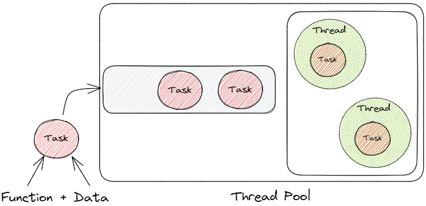
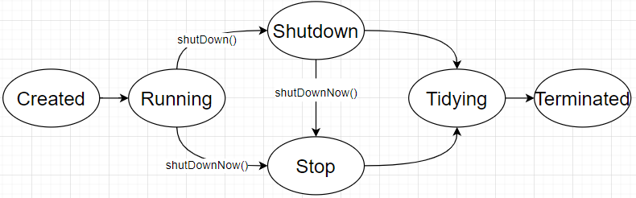

# 线程
## 创建线程

1. 继承Thread（Java只有单继承，占用了继承的位置）
2. 实现Runnable（线程任务无返回值）
3. 实现Callable（有返回值的线程任务）

## 线程状态


4. new：新建状态
5. Runnable：可执行状态，等待CPU调度；
6. Running：执行状态；
7. Blocked：等待锁状态；
8. Waiting：无限等待状态，线程进入Waiting后，需要被唤醒，继续进入Runnable状态；
9. Time Waiting：等待固定时间，无需唤醒，超时后自动唤醒，进入Runnable状态；
10. Terminated：任务执行完毕、抛出异常等后的终止状态；

## 如何中断线程

11. 暴力中断，执行`stop()`，直接kill线程，会导致任务终止，且停止时间不可把控；
```java
@Test
public void stop_thread(){
    CustomThread thread = new CustomThread();
    thread.start();
    thread.stop();  // native 方法暴力中断，不可把控真实的停止时间
}
```

12. 使用Thread自带的中断标志位，到达自定义的安全点后进行中断；
```java
@Test
public void interrupted_thread() throws InterruptedException {
    CustomThread thread = new CustomThread();
    thread.start();
    TimeUnit.MILLISECONDS.sleep(100);
    thread.interrupt();
    TimeUnit.SECONDS.sleep(1);
}

class CustomThread extends Thread {
    @Override
    public void run() {
        while (!Thread.interrupted()) {
            System.out.println("running");
        }
        System.out.println("thread is stopped"); // quit
    }
}
```

13. 在线程内部的业务中，自行设置标志位，来中断正在执行的业务；（与2类似）

```java
@Test
public void interrupted_thread() throws InterruptedException {
    CustomThread thread = new CustomThread();
    thread.start();
    TimeUnit.MILLISECONDS.sleep(100);
    thread.cancel();     // 执行cancel设置中断状态，线程到达安全点后退出；
    TimeUnit.SECONDS.sleep(1);
}

class CustomThread extends Thread {
    private boolean cancel;
    @Override
    public void run() {
        while (!cancel) {
            System.out.println("running");
        }
        System.out.println("thread is stopped"); // quit
    }

    public void cancel() {
        this.cancel = true;
    }
}
```


# 线程池



线程池是一个**生产者消费者模型**；业务中产生任务，由线程池进行消费；

14. 任务：即告知线程如何处理特定数据；**任务 = 函数 + 数据**；
15. 队列：缓冲待处理任务；
16. 线程：由线程池管理的可以复用的线程，消费队列任务；

## 为什么要线程池

17. <font color="#f79646">创建线程和销毁线程的花销是比较大</font>的；使用线程池提前创建线程，直接用即可，提高运行时效率
18. <font color="#f79646">线程不进行管理，设计不当，有可能无休止占用资源</font>；使用线程池方便管理，避免无休止的创建线程，占用系统资源；
19. 不建议使用`Executors`创建线程池，应该使用`ThreadPoolExecutor`创建
	- Executors线程池参数被隐藏，不可控；
	- 如：`SingleThreadExecutor`、`newFixedThreadExecutor`都会使用无界队列，存在内存安全问题；

## 正确使用线程池

20. 明确线程要执行的任务类型
	- CPU密集型：不依赖外部IO，仅执行计算任务；
	- IO密集型：任务中计算部分占用不多，更多的是磁盘、网络IO等；
21. 不同的线程任务应该使用不同的线程池
	- 不同的任务的资源占用、执行耗时、任务量都不相同，使用不同的线程池，更好的把控系统资源；
22. 线程池数的设置
	- CPU密集型：这类任务执行中由于不需要等待IO，因此不需要过多的线程；==线程数 == CPU核数即可==
	- IO密集型：需要计算任务中的计算和IO时间占比；得出经验公式：$N * (1 + \frac{WT}{CT})$，一个参考就是当时间占比相当，线程数看看呀设置为2倍CPU核数，且IO时间占比越大，线程数量可以适当上调；
23. 明确线程池内其他参数，如任务队列、拒绝策略；因此不建议使用`Executors`创建线程池，应该使用`ThreadPoolExecutor`创建

## ThreadPoolExecutor

```java
// 最多的七参构造器，前五个参数必须
public ThreadPoolExecutor(int corePoolSize, // 核心池大小
                          int maximumPoolSize,  // 最大线程数
                          long keepAliveTime, // 空闲线程等待时间
                          TimeUnit unit,  // 等待时间单位
                          BlockingQueue<Runnable> workQueue,  // 任务队列    
                          ThreadFactory threadFactory,  //线程工厂
                          RejectedExecutionHandler handler) //拒绝策略
```
24. **corePoolSize：核心池的大小，并非线程的最大数量**
	  - maximumPoolSize > corePoolSize
	  - 在创建了线程池后，线程池中的线程数为0，当有任务来之后，就会创建一个线程去执行任务，当线程池中的线程数目达到corePoolSize后，就会把到达的任务放到**缓存队列当中**；
25. maximumPoolSize：线程池的最大线程数，表示线程池中最多能创建多少个线程
	  - 非核心线程 = maximumPoolSize-corePoolSize
	  - 只有队列无法存放更多的任务，才会启用非核心线程；
	  - 冗余思想设计：核心线程数代表任务执行常态需要的数量，但是对于不好把控的业务，需要设计成冗余的，如果任务过多，需要增加额外的线程；
26. **keepAliveTime：表示线程没有任务执行时最多保持多久时间会被销毁**
	  - 默认：只有线程池内线程数大于corePoolSize的线程，keepAliveTime才会对其计时
	  - 当一个线程的空闲时间大于keepAliveTime，则会被终止
	  - 如果调用了allowCoreThreadTimeOut(boolean)，线程池内线程数小于corePoolSize，keepAliveTime也会起作用
	  - 如果任务的执行时间 > 线程的存活时间，线程则不会被复用；
27. unit：参数keepAliveTime的时间单位（七种单位）
28. **workQueue：选择一个阻塞队列**
29. **threadFactory：线程工厂，线程池用来创建线程的工厂方法**。如果不传此参数
	  - 默认：`Executors.defaultThreadFactory()`
	  - `NamedThreadFactory`：命名线程池
30. **RejectedExecutionHandler：表示当拒绝处理任务时的策略（线程池无法再容纳的线程）**
	- 如果不传此参数，默认：ThreadPoolExecutor.AbortPolicy
  
```
// 丢弃任务并抛出RejectedExecutionException异常。 
ThreadPoolExecutor.AbortPolicy 
// 也是丢弃任务，但是不抛出异常。
ThreadPoolExecutor.DiscardPolicy 
// 丢弃队列最前面的任务，然后重新尝试执行任务（重复此过程）
ThreadPoolExecutor.DiscardOldestPolicy
// 由调用线程处理该任务 
ThreadPoolExecutor.CallerRunsPolicy
```

## 线程池状态


**Running**：正常运行状态；
**ShutDown**：调用`shutdown()`，进入Shutdown状态，线程池进入关闭状态，不再接受任务，继续执行正在执行的任务和队列任务
**Stop**：调用`shutdownnow()`，进入Stop状态，线程池处于停止状态，不再接受新的任务，不处理队列任务，中断正在运行的任务；
**Tidying**：当线程池的任务都结束(执行完或被中断)，进入整理状态，线程池会自动调用`terminated()`方法，进入终止状态；
**Terminated**：线程池完全停止状态；

## 线程池核心方法

31. `submit()`：返回值为Future，可以get运行结果或异常，如果不get，则不会感知异常；
32. `execute()`：没有返回值，可以抛出异常；
33. `shutdown()`：不再接受新的任务，等待正在执行的任务和队列中的任务执行完成，状态变为：shutdown；
34. `shutdownNow()`：在shutdown的基础上，尝试中断运行中的线程，并清空队列，状态变为：stop；返回未完成的任务；
35. `awaitTermination(long timeout,TimeUnit unit)`：阻塞等待线程池终止，或事件结束，返回线程池状态是否为terminate；
36. 状态判断：
	- `isShutdown()`：线程池是否被shutdown，正在停止/或已经停止都算shutdown
	- `isTerminated()`：线程池是否已经停止
	- `isTerminating()`：线程池是否正在停止，shutdown之后，真正停止之前都是terminating

```
@Test
public void shutdown_thread_pool() throws InterruptedException {
    CountDownLatch latch = new CountDownLatch(5);
    for (int i = 0; i < 5; i++) {
        String message = "Thread [" + i + "]+ is running";
        threadPoolExecutor.execute(() -> {
            System.out.println(message);
            try {
                TimeUnit.SECONDS.sleep(5);
            } catch (InterruptedException e) {
                System.out.println("interrupted");
            } finally {
                latch.countDown();
            }
        });
    }
    // 阻止新来的任务提交，对已经提交了的任务不会产生任何影响, 队列也不受影响 会继续执行完毕，仅仅是不再接受新的任务
    // 线程池状态变为：shutdown
    threadPoolExecutor.shutdown();
    logThreadPoolStatus();  // isShutdown:true, isTerminated:false, isTerminating:true,queue size:4
    latch.await();

    boolean res = threadPoolExecutor.awaitTermination(10, TimeUnit.SECONDS);
    logThreadPoolStatus(); // isShutdown:true, isTerminated:true, isTerminating:false,queue size:0
}
```


## 可视化线程池的执行过程

37. 任务提交：
	1. 任务优先提交给**核心线程**，核心线程未满则执行；
	2. 核心线程已满，则将任务尝试放入**队列**中；
	3. 核心满、队列也满了，则会创建新的线程，任务提交给**非核心线程**，直到线程总数达到设定的上限；
	4. 核心满、队列满、非核心也满（线程数达到上限），则执行**拒绝策略**；

下面代码可以可视化的展示线程池内的执行过程：
```
/**
 * <pre>
 * 1、线程会先占用核心池，满了(最大核心+队列)之后去队列等待；
 * 2、队列满了之后，如果还没有达到最大线程数量，继续创建线程；
 * 3、到最大线程数，启动拒绝策略；
 * </pre>
 * <pre>
 * PoolSize: 1,Queue[]  任务直接交给核心线程
 * PoolSize: 2,Queue[]  任务直接交给核心线程
 * PoolSize: 2,Queue[Task_2]    核心线程满，放入队列
 * PoolSize: 2,Queue[Task_2, Task_3]
 * PoolSize: 2,Queue[Task_2, Task_3, Task_4]
 * PoolSize: 2,Queue[Task_2, Task_3, Task_4, Task_5]
 * PoolSize: 2,Queue[Task_2, Task_3, Task_4, Task_5, Task_6]
 * PoolSize: 3,Queue[Task_2, Task_3, Task_4, Task_5, Task_6]  队列满，增加线程数，直到满足最大线程
 * Rejected：Task_8   启动拒绝策略
 * </pre>
 */
public class ThreadPoolWorkFlow {

    private static final int CORE_POOL_SIZE = 2;

    private static final int MAX_POOL_SIZE = 4 ;

    private static final int QUEUE_SIZE = 5;

    // 2+3 总共5个线程，总计可以同时持有任务3+5=8个
    private static final ThreadPoolExecutor threadPoll = new ThreadPoolExecutor(
            CORE_POOL_SIZE,
            MAX_POOL_SIZE,
            2000,
            TimeUnit.MILLISECONDS,
            new ArrayBlockingQueue<>(QUEUE_SIZE),
            new MyRejectedHandler());

    public static void main(String[] args) throws InterruptedException {
        // 创建 10 个任务添加
        for (int i = 0; i < 10; i++) {
            String name = "Task_" + i;
            Task task = new Task(name);
            try {
                threadPoll.execute(task);
                if (QUEUE_SIZE == threadPoll.getQueue().size() && threadPoll.getPoolSize() < MAX_POOL_SIZE) {
                    // 队列满，线程池未满，任务继续添加线程到线程池内的非核心池中
                    System.out.println("=============== Queue Is Full ==============");
                    System.out.println("PoolSize: " + threadPoll.getPoolSize() + ", Queue" + threadPoll.getQueue());
                } else if (threadPoll.getPoolSize() <= MAX_POOL_SIZE){
                    // 队列未满，任务加入队列
                    System.out.println("PoolSize: " + threadPoll.getPoolSize() + ", Queue" + threadPoll.getQueue());
                }
            } catch (Exception e) {
                System.out.println("Refused:" + name);
            }
        }

        threadPoll.shutdown();
        threadPoll.awaitTermination(5, TimeUnit.MINUTES); // 阻塞等待线程池关闭,返回是否关闭成功
    }

    /**
     * 线程
     */
    static class Task implements Runnable {
        private final String name;

        public Task(String name) {
            this.name = name;
        }

        @Override
        public void run() {
            try {
                Thread.sleep(2000);
            } catch (InterruptedException e) {
                e.printStackTrace();
            }
        }

        @Override
        public String toString() {
            return this.name;
        }
    }

    /**
     * 线程 拒绝策略
     */
    static class MyRejectedHandler implements RejectedExecutionHandler {
        @Override
        public void rejectedExecution(Runnable r, ThreadPoolExecutor executor) {
            System.out.println("Rejected：" + r.toString());
        }
    }
}
```

## ForkJoinPool

传统的线程池将平等执行所有任务，依赖于执行队列；
在传统的线程池基础上，增加分叉、合并的操作，实现并行执行，提高执行效率；

适用场景：计算密集型的父子关系任务；具有优先级的任务；

因此，在web服务领域，使用较少，不适合IO密集型场景；

# 线程间的通信

线程间通讯的2中核心方式：
38. 共享内存；存在并发安全性问题，需要使用锁来保证；
39. 消息队列；

线程通讯的实现方式：
40. `synchronized + wait + notify`
41. `ReentrantLock + Condition`
42. `volatile`：仅解决了并发原则中的可见性和有序性，不保证原子性；
43. `CountDownLatch`：用于把控线程执行顺序，主任务等待一批子任务结束后，再执行；基于AQS；
44. `CyclicBarrier`：可以重复使用的`CountDownLatch`；
45. `Semaphore`：用来控制同时访问特定资源的线程数量；基于AQS实现；
46. 消息队列；


