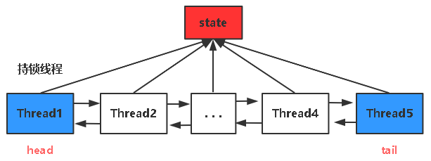
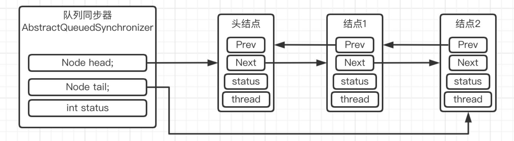
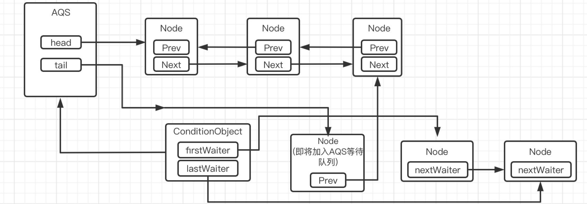

# AQS并发基石

AbstractQueuedSynchronizer：抽象队列同步器，是JUC的基石，JUC包下很多内容是基于AQS实现的；

>一句话来说：AQS就是Java来管理并发线程争夺共享资源的一个管理员；通过让定义抽象的共享资源状态、控制线程排队等来保证并发的安全。
>AQS核心解决了2个问题：
>- 避免线程的CPU资源浪费：避免了线程在未获取资源时空转，AQS会让其休眠等待；
>- 避免了线程饥饿问题：AQS可以实现公平锁模式，先到先得，也可以使用非公平模式，提高效率；

如：
- **ReentrantLock**：基于AQS实现的重入锁；使用state标记资源是否被占用，使用Node队列排队线程实现公平锁；
- **ThreadPoolExecutor**：Worker线程
- **CountDownLatch**：依赖state进行计数；
- **Semaphore**：基于state记录资源数；获取资源、归还资源使用state加减操作记录；

## AQS重要属性



- <font color="#f79646">state</font>：是同步资源的抽象，由volatile修饰的int类型变量；
  - `state>=1`：锁定状态/重入状态；表示已有线程获取锁；大于1则表示锁重入；
  - `state==0`：未锁定状态，线程可以通过CAS修改state状态来尝试获取锁；

- <font color="#f79646">Node节点</font>：线程抽象，并规范了线程的类型、状态；
  - Node类型：
    - `EXCLUSIVE类型`：独占操作；
    - `SHARED类型`：共享操作；
  - Node状态(线程状态 waitStatus)：
    - 初始化时状态为0
    - `CANCELLED`：线程已被取消；可能超时或中断
    - `SIGNAL`：等待状态，后继节点阻塞，需要被唤醒；
    - `CONDITION`：线程正在等待关联的Condition监视器；
    - `PROPAGATE`：不理解 // TODO

- Node双向链表：线程队列：
  - 队列的每一个Node装载一个线程；


## AQS重要方法
- **acquire**：尝试获取锁；
  - 1、获取AQS的state，如果`state==0`尝试使用**CAS的方式**获取锁；
    - 非公平锁：直接尝试一次；
    - 公平锁：队列中有其他线程则不执行，没有则执行；
  - 2、如果持锁线程是当前线程，则直接获取锁；state+1
- **tryRelease**：释放锁，每次state-1，直到为0，锁被释放；当释放锁后，执行unpack方法来唤醒线程；
- **addWaiter**：线程通过**CAS操作**入队；
  - 如果队列存在，则入队；不存在，则初始化队列，再入队；

# Synchronized
synchronized关键字加锁是**JVM级别**的**非公平锁**，**自动加锁自动释放**；

1. 对象锁：每个对象实例都有一把自己的锁，不同对象间锁不同；
2. 类锁：用于static方法，则所有对象共用一把锁；
3. 正常执行完毕、抛出异常，都会释放锁；
## Synchronized执行过程

主要借助于：对象头 + Monitor监视器

对象头的Mark Word记录的信息有：
- hash: 对象的哈希码
- age: 对象的分代年龄
- biased_lock: 偏向锁标识位
- lock: 锁状态标识位
- JavaThread: 持有偏向锁的线程ID
- epoch: 偏向时间戳

通过组合**偏向锁标志位** + **锁标志位** 可以表达**锁的不同状态**：

| 锁状态  | 偏向锁标志位 | 锁标志位 |
| ---- | ------ | ---- |
| 无锁   | 0      | 01   |
| 偏向锁  | 1      | 01   |
| 轻量级锁 | 无      | 00   |
| 重量级锁 | 无      | 10   |

## Synchronized的使用

```java
public synchronized void test(){
  // ...
}
```
在常量池中生成一个`ACC_SYNCHRONIZED`标识符

当线程尝试调用此方法，会在此标志位设置值，如果设置成功，则此线程获取`monitor`监视器

2、Synchronized同步代码块
```java
public void test(){
    // ...
    synchronized(this){
      // ...
    }
}
```
在同步代码块的入口，执行指令：`monitorenter`监视器入口，线程尝试获取锁对象
- 获取成功，计数器加+1；
- 获取不成功，根据当前锁级别，自旋或者阻塞；
  
执行同步代码，结束时，会调用指令`monitorexit`释放锁；
- 计数器减一；当计数器为0，才会释放锁；即可重入；

## Synchronized的锁优化

偏向锁 —> 轻量级锁 —> 重量级锁

# Lock接口

Synchronized是JVM层面的锁；

Lock接口规范了JDK层面的锁，提供了更加丰富的锁操作，并且可以实现公平锁、非公平锁、读写锁(ReadWriteLock)；


```java
public interface Lock {
    // 获得锁
    void lock();
    // 获得锁
    void unlock();
    // lock非阻塞版本，成功返回true
    boolean tryLock();
    // 添加尝试时间，时间到返回false
    boolean tryLock(long time, TimeUnit unit)
    // 返回一个监视器对象，供线程间同步使用
    Condition newCondition();
}
```

## ReenTrantLock
Lock的实现类，JDK层面的锁；

三个主要的锁抽线内部类：
- Sync（继承AQS）：锁抽象；
- NonfairSync（继承Sync）：非公平锁抽象；
- FairSync（继承Sync）：公平锁抽象；

可实现的锁类型：
1、非公平锁：
```java
// 默认：非公平锁，比较高效
public ReentrantLock() {
    sync = new NonfairSync();
}
```
2、公平锁：
```java
// 公平锁
public ReentrantLock(boolean fair) {
    sync = fair ? new FairSync() : new NonfairSync();
}
```
3、可中断锁：等待锁的过程中可以响应中断；
```java
try{
  lock.lockInterruptibly()
}catch(InterruptedException e){
  // ...
}
```
4、tryLock设置等待时间，超时后返回false，执行其他操作；
```java
tryLock()
tryLock(long time, TimeUnit unit)
```

## ReentrantReadWriteLock

增加ReadLock读写、WriteLock写锁，是在ReentrantLock基础上实现的；

读写状态通过一个32位int值来维护：

`0000 0000 0000 0100 | 0000 0000 0000 0001`
- 高16位记录读状态；
- 低16位记录写状态；

通过位移操作读写改变：
- 获取读状态：将`c`右移16位；
- 获取写状态：和`0000 0000 0000 0000 1111 1111 1111 1111`相与获得

# Condition

每个Condition在AQS中会创建一个**条件队列**，类似Node队列；
- 当线程使用对应`Condition.await()`时，此<font color="#f79646">线程将释放锁</font>，并加入到这个`Condition`的队列中进行等待；
- 当使用`Condition.signal()`则唤醒这个队列中的某个线程，此线程重新加入AQS队列，竞争锁；
- 当使用`Condition.signalAll()`则唤醒这个队列下的所有线程；



下面是一个Lock和Condition的使用例子：生产者消费者模型
- 生产者生产数据到缓冲区，如果缓冲区满了，则生产者等待，并唤醒消费者线程；
- 消费者从缓冲区消费数据，如果缓冲区空了，则消费者等待，并唤醒生产者线程；

```java
public class LockProducerConsumerExample {

    private final Queue<Integer> buffer = new LinkedList<>(); // 共享缓冲区
    private final int capacity = 10; // 缓冲区最大容量
    private final Lock lock = new ReentrantLock(); // 锁对象
    private final Condition notFull = lock.newCondition(); // 缓冲区未满的条件
    private final Condition notEmpty = lock.newCondition(); // 缓冲区非空的条件

    // 生产者方法：向缓冲区添加数据
    public void produce(int value) throws InterruptedException {
        lock.lock(); // 获取锁
        try {
            // 如果缓冲区已满，生产者等待
            while (buffer.size() == capacity) {
                System.out.println("缓冲区已满，生产者等待...");
                notFull.await(); // 等待"未满"条件
            }

            buffer.add(value);
            System.out.println("生产数据: " + value + "，缓冲区大小: " + buffer.size());

            // 唤醒等待"非空"条件的消费者
            notEmpty.signalAll();
        } finally {
            lock.unlock(); // 确保释放锁
        }
    }

    // 消费者方法：从缓冲区取出数据
    public int consume() throws InterruptedException {
        lock.lock();
        try {
            // 如果缓冲区为空，消费者等待
            while (buffer.isEmpty()) {
                System.out.println("缓冲区为空，消费者等待...");
                notEmpty.await(); // 等待"非空"条件
            }

            int value = buffer.poll();
            System.out.println("消费数据: " + value + "，缓冲区剩余: " + buffer.size());

            // 唤醒等待"未满"条件的生产者
            notFull.signalAll();
            return value;
        } finally {
            lock.unlock();
        }
    }

    // 测试代码
    public static void main(String[] args) {
        LockProducerConsumerExample example = new LockProducerConsumerExample();

        // 生产者线程
        Thread producer = new Thread(() -> {
            try {
                for (int i = 1; i <= 20; i++) {
                    example.produce(i);
                    Thread.sleep(100); // 模拟生产耗时
                }
            } catch (InterruptedException e) {
                Thread.currentThread().interrupt();
            }
        });

        // 消费者线程
        Thread consumer = new Thread(() -> {
            try {
                for (int i = 0; i < 20; i++) {
                    example.consume();
                    Thread.sleep(200); // 模拟消费耗时
                }
            } catch (InterruptedException e) {
                Thread.currentThread().interrupt();
            }
        });

        producer.start();
        consumer.start();
    }
}
```


