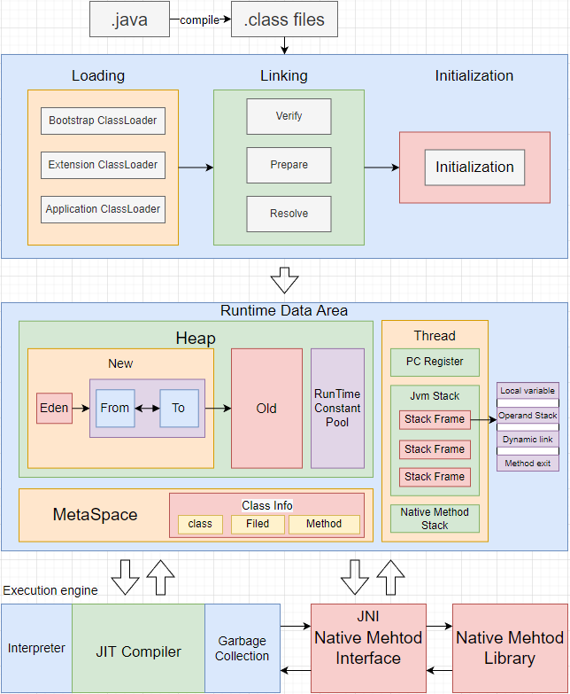
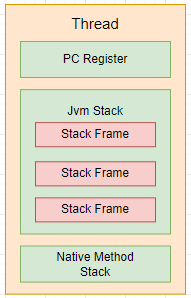

执行一个Java进程对应启动一个JVM进程；

Java虚拟机使用的是HotSpot虚拟机；18年oracle公开了GraalVM；

# Jvm内存结构

> 栈代表了处理逻辑，而堆代表了数据；
> 从线程角度可以分为2个区域：
> - 线程私有区；
> 	- 程序计数器；
> 	- 虚拟机栈；
> 	- 本地方法栈；
> - 线程共享区；
> 	- Heap区；
> 	- Non-heap 方法区；（元空间）
> 	- 直接内存；

# 1. 线程私有区

每个线程运行时所使用的内存结构，包含：程序计数器、多个栈帧对应每次方法调用，其中包含一个活动栈帧，对应正在执行的方法，以及调用Native方法的本地方法栈；
- 垃圾回收不涉及栈内存；
- 且栈内存并不是越大越好；`-Xss 1024k`、`-Xss 1m`
- 栈帧内局部变量是线程安全的；

栈的结构：
1. **程序计数器**：记录当前线程下一条要执行的指令；
2. **虚拟机栈**：用来存储局执行方法执行所需要的数据(生命周期跟随线程)；
	- 存储单元为**栈帧·**，每一个方法执行到结束，对应一个栈帧的入栈出栈
	- 每个栈帧：包含部变量表、操作数栈、动态链接、方法出口等信息
	- **局部变量表**：用来生成此方法所需要的所有局部变量，提前给定内存空间；(编译期确定)
	-  **操作数栈**：存储方法中的计算过程的中间结果；
	-  **动态链接**：指向常量池中的符号引用，如需要调用别的方法，就通过动态链接找到方法引用；
	- **方法出口**
3. **本地方法栈**：与虚拟机栈的作用类似，用于执行Native方法(非Java方法)；
	- 如Unsafe类，用于与操作系统交互；
	- Object下的`wait()`、`notify()`、`notifyAll()`都是Native方法；

# 2. 线程共享区

## 2.1 Heap

主要用于存放对象实例以及数组；(垃圾回收的主要区域)
- 年轻代
- 老年代
- **字符串常量池(JDK1.8)**：存放编译/运行时创建的字面量:`new String("xx")`

### 2.1.1 年轻代
**年轻代目标**：尽可能快速的收集掉那些生命周期短的对象，减少存入老年代的对象；

**结构**：Eden、Survivor(两个)

年轻代存储过程：

1. 大多数新创建的对象都位于Eden内存空间中；
2. 当Eden区满时，触发MinorGC，存活的对象被复制到Survivor区中的一个
3. 之后每经历一次MinorGC，gc年龄+1（gc年龄初始为1，记录在对象头中）
4. gc年龄达到阈值仍存活的对象，则可进入老年代；也可能由于空间不足，提前进入老年代，默认50%；即按照年龄排序后，超出50%的大年龄对象，会在MinorGC时移入老年代
(复制算法：对象从Survivor一个区移动到另一个区，并回收不可达对象)

### 2.1.2 老年代

# 3. 相关问题

## 3.1 为什么要分年轻代和老年代？

## 3.2 为什么用元空间代替永久代

